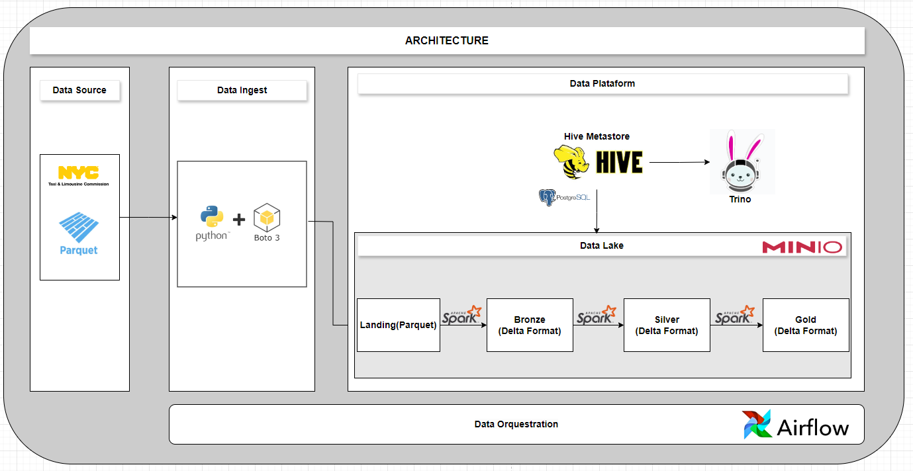
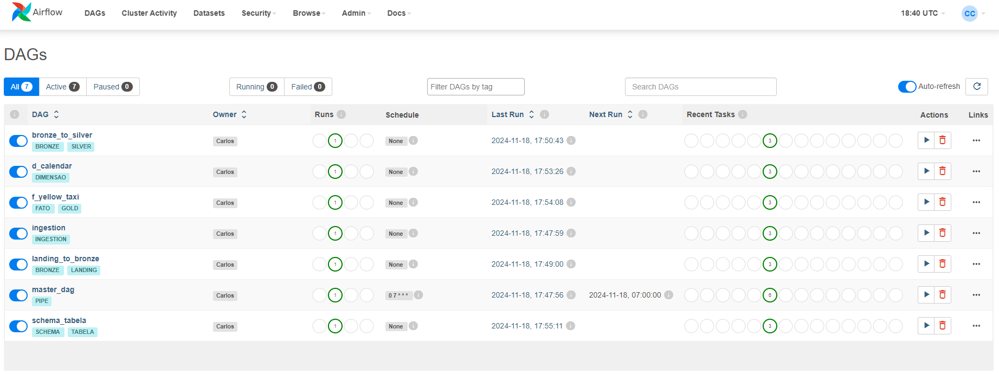

# Ifood Engenharia de Dados

<p>


</p>

Este projeto implementa um pipeline de dados para a ingestão e processamento de registros de viagens de táxi da cidade de Nova York, fornecidos pela NYC Taxi & Limousine Commission. Os dados são capturados por meio de um end-point, armazenados em formato `parquet` e `delta lake` em um data lake baseado em `S3 (MinIO)` e processados utilizando o `Apache Spark`. A orquestração do pipeline é realizada pelo `Apache Airflow`, enquanto o `Apache Hive Metastore` e o `Trino` são responsáveis pela metadados e pela consulta aos dados processados.

A arquitetura do projeto é apresentada de maneira clara e objetiva na imagem a seguir:

<p align="center">

</p>

O Data Lake foi organizado em camadas que refletem as diferentes etapas de transformação dos dados. A camada landing armazena os dados brutos, recém-ingeridos, mantendo sua estrutura original. A camada bronze replica a estrutura da camada landing, porém em formato delta lake para garantir maior robustez e permitir a versionagem. Na camada silver são realizadas as primeiras transformações, como padronização de colunas e remoção de duplicatas, preparando os dados para análises mais refinadas. Por fim, a camada gold contém os dados finais, totalmente processados e otimizados para atender às necessidades específicas das análises.

Para atender às demandas de análise, foram selecionados os seguintes campos da tabela gold: `VendorID`, `passenger_count`, `total_amount`, `tpep_pickup_datetime` e `tpep_dropoff_datetime`. [Este](https://www.nyc.gov/assets/tlc/downloads/pdf/data_dictionary_trip_records_yellow.pdf) é um guia completo dos campos da tabela de origem. Aqui você encontrará a explicação de cada um deles.Com base nesses dados, serão calculadas:

A média do valor total (total_amount) recebido por todos os táxis amarelos em um mês.
A média de passageiros (passenger_count) por hora e por dia para toda a frota de táxis amarelos.
É importante destacar que a granularidade original da tabela foi mantida para estas análises.

## Como começar o deploy do Projeto
A arquitetura completa foi containerizada utilizando a plataforma Docker, garantindo portabilidade dos serviços. Dito isso é necessário instalar [docker](https://www.docker.com/) para executar o projeto e o software [Dbeaver](https://dbeaver.io/download/).

Com o Docker instalado, abra um terminal, localize a pasta principal do projeto e execute os comandos:

``` 
docker compose build
docker compose up -d
``` 

Em caso de falha na inicialização de algum serviço, reinicie os contêiners do Docker de forma isolada.

Os serviços `Apache Airflow`, `Apache Spark`, `MinIO` e `Trino`, possuem interface, que pode ser verificada pelas seguintes URIs.
- MinIO: `localhost:9001`
- Spark: `localhost:9090`
- Trino: `localhost:8181`
- Airflow: `localhost:8080`

## Serviços e Funcionalidades

Na interface do Apache Airflow, foi definido um Grafo Acíclico Direcionado (DAG), chamada `master_dag`, para orquestrar a execução completa do pipeline de dados, desde a ingestão até a disponibilização dos dados para análise. Ela pode ser acionada na interface do Airflow. Acesse a [interface](https://localhost:8080) e acione a DAG.

Ao término do processo, todos os dados foram ingeridos, transformados e carregados para a camada gold, tornando-os disponíveis para análise e geração de insights. A exemplo da imagem:

<p align="center">

</p>

Cada DAG criada no Apache Airflow é responsável por orquestrar uma sequência específica de tarefas dentro do pipeline de dados. 

- ingestion: Responsável pela ingestão inicial dos dados, salvando-os em arquivos Parquet na camada landing, preservando a estrutura original.
- landing_to_bronze: Transfere os dados da camada landing para a camada bronze, mudando o formato Parquet para Delta.
- bronze_to_silver: Realiza a transformação dos dados da camada bronze, incluindo a limpeza, padronização, remoção de duplicatas, preparando os dados para análises mais complexas.
- f_yewllow_taxi: Filtra os dados da camada silver, selecionando apenas as colunas relevantes para a análise de yellow_taxi, e armazena o resultado na camada gold.
- schema_tabela: Cria a estruturação lógica dos dados no Hive Metastore, definindo os schemas e as tabelas externas que mapeiam as camadas do Data Lake, facilitando a consulta e a análise dos dados por meio de ferramentas SQL.

Para garantir a manutenibilidade e a escalabilidade do projeto, optou-se por uma abordagem modularizada. As classes [ExtractDelta](./jobs/modulos/extract/ExtractDelta.py) e [LoadDelta](./jobs/modulos/load/LoadDelta.py) encapsulam as lógicas de extração e de carregamento de dados em delta, respectivamente. 


Ao final do processo, podemos verificar se os dados foram armazenados corretamente no [MinIO](htts://localhost:9001) e analisar os registros de execução do [Spark](htts://localhost:9090) para garantir que tudo ocorreu como esperado.

Persistencia dos Dados:

<p align="center">

</p>

Logs de Execução:
<p align="center">

</p>

## Analises
Finalmente, a etapa de análise de dados pode ser iniciada. Utilizando a linguagem SQL e o cliente de banco de dados DBeaver, é possível realizar consultas diretamente no data lake via Trino.

Logs de Execução:
<p align="center">

</p>

Utilizando a URL JDBC:
``` jdbc:trino://localhost:8181/hive/ ```

Para usuários basta informar `hive`. Através da conexão com o Trino, é possível acessar diretamente o catálogo Delta, especificamente o esquema gold. Essa integração permite consultar os dados processados e refinados armazenados no data lake, proporcionando uma interface SQL para análise e exploração dos dados.

Para a primeira analise basta executar o seguinte código:
```
with
	MONTHLY_AMOUNT AS(
		select 
			date_trunc('month',T."TPEP_PICKUP_DATETIME") as pickup_month
			,sum(T."TOTAL_AMOUNT") as total_amount
		from gold.f_yellow_taxi t
		group by 1
		order by 1
	)
select 
	avg(TOTAL_AMOUNT)
from MONTHLY_AMOUNT;
```

Para a segunda analise basta executar o seguinte código:
```
--MÉDIA POR DIA
WITH COUNT_PASSENGER AS (
    SELECT 
        date_trunc('day', T."TPEP_PICKUP_DATETIME") AS PICKUP_DAY,
        SUM(T."PASSENGER_COUNT") AS TT_PASSENGER
    FROM gold.f_yellow_taxi T
    GROUP BY 1
)
SELECT
    AVG(TT_PASSENGER)
FROM COUNT_PASSENGER;

--MÉDIA POR HORA

WITH COUNT_PASSENGER AS (
    SELECT 
        CAST(date_trunc('day', T."TPEP_PICKUP_DATETIME") AS DATE) AS PICKUP_DAY,
        date_trunc('hour', T."TPEP_PICKUP_DATETIME") AS PICKUP_HOUR,
        SUM(T."PASSENGER_COUNT") AS TT_PASSENGER
    FROM gold.f_yellow_taxi T
    GROUP BY 1, 2
)
SELECT
    AVG(TT_PASSENGER)
FROM COUNT_PASSENGER;
```

Para monitorar o consumo de recursos computacionais de cada consulta no Trino, é possível utilizar a [interface](https://localhost:8181) com o usuário `trino`, que fornece métricas detalhadas sobre o tempo de execução, pico de memória e outros indicadores de performance.

<p align="center">

</p>

## Considerações Gerais
Todas as tabelas criadas no hive-metastore são tabelas externas. Isso significa que o Metastore armazena apenas as informações de metadados da tabela, como o esquema (nome das colunas e seus tipos de dados), a localização dos dados no armazenamento subjacente (como o S3) e outras propriedades. Os dados reais da tabela não são armazenados no Metastore, mas sim em um sistema de armazenamento externo. Essa abordagem, foi adotada para simplificar a arquitetura, onde a maior responsabilidade é gerir os dados no data lake.

Para facilitar a identificação e resolução de problemas, cada DAG deve ter uma função específica. Ao dividir as tarefas em DAGs menores e mais focadas, fica mais fácil encontrar a origem de qualquer erro que possa ocorrer no processo.

A ideia inicial da arquitetura era fazer o gerenciamento de novas cargas com base nos metadados das tabelas e dos dados sendo persistindos no MinIO. Contudo, essa funcionalidade não está implementada.


## De-Para Aruitetura AWS

<p align="center">

</p>